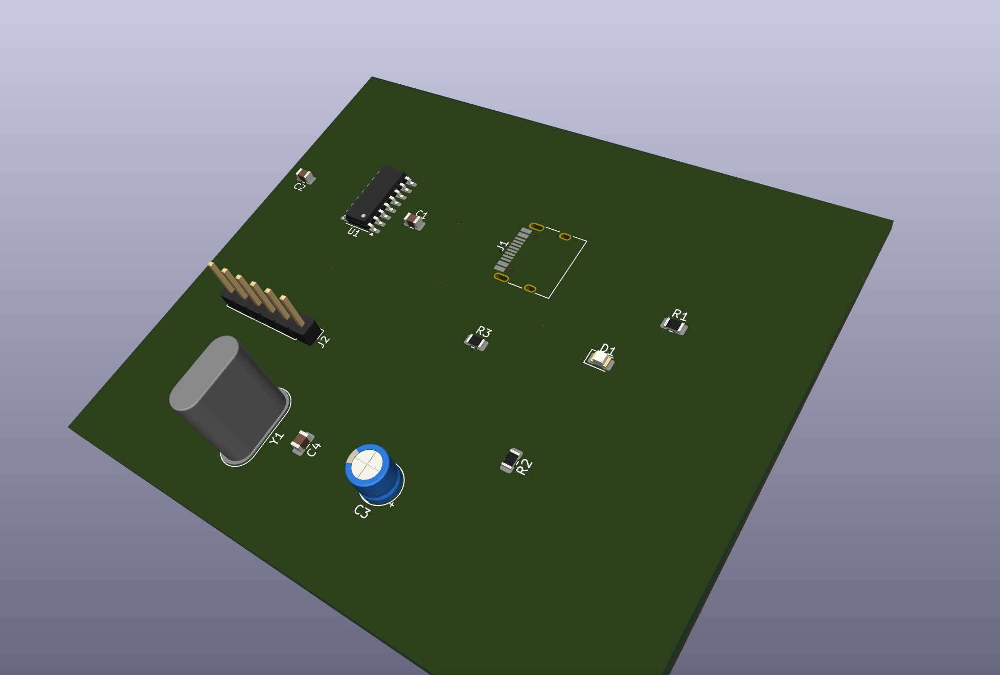
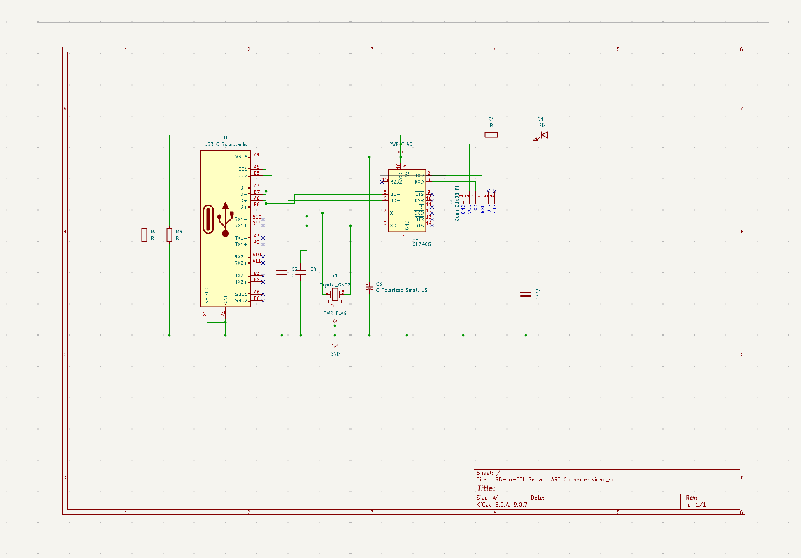
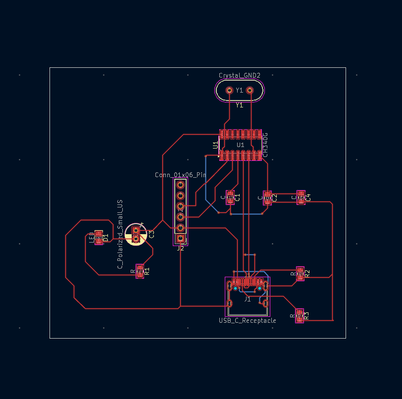

# ⚡ USB-to-TTL Serial UART Converter (Finalized / Tamamlandı)

Bu depo, **CH340G** entegresi ve modern **USB-C** konnektörü temel alınarak tasarlanmış, tam donanımlı bir USB-to-TTL dönüştürücü projesini içerir.

This repository contains the finalized KiCad design files for a professional USB-to-TTL converter based on the **CH340G** IC and a modern **USB-C** connector.

---

## 📸 Proje Görselleri / Project Visuals

### 1. 3D Model Tasarımı / 3D Model Design

*USB-C arayüzü ve CH340G köprüsü ile kompakt ve fiziksel olarak optimize edilmiş nihai tasarım.*
*The final physical layout featuring a compact USB-C interface and the CH340G bridge.*

### 2. Devre Şeması / Schematic Diagram

*Kristal osilatör devresi ve gürültü engelleyici kapasitör katmanlarını içeren hassas elektriksel tasarım.*
*Precise electrical design including the crystal oscillator circuit and decoupling capacitors.*

### 3. PCB Yolları ve Yerleşim / PCB Layout & Routing

*Sinyal bütünlüğü için optimize edilmiş bakır yollar ve geniş yer düzlemi (ground plane) uygulaması.*
*The finalized copper layers with optimized routing and a solid ground plane for signal integrity.*

---

## 🛠️ Teknik Detaylar / Technical Details
- **Main IC:** CH340G (Güvenilir USB-Seri dönüştürücü / Reliable USB-to-Serial bridge)
- **Connector:** USB Type-C (16-pin SMT)
- **Software:** KiCad 8.0
- **Özellikler / Features:** - Optimize edilmiş 12MHz kristal osilatör devresi. / Optimized 12MHz crystal circuit.
    - Profesyonel güç filtreleme kapasitörleri. / Professional-grade power filtering.
    - Kolay prototipleme için net UART çıkış pinleri. / Clear UART breakout pins.

## 📈 Öğrenim Kazanımları / Learning Outcomes
* **Kısıtlamaları Aşmak:** Dar alanlardaki (USB-C) Tasarım Kuralı Hatalarını (DRC) başarıyla çözme yetisi. / Successfully solved DRC violations in tight spaces.
* **Yüksek Yoğunluklu Tasarım:** Sıkışık pin aralıklarında yol yönetimi deneyimi. / Gained experience in high-density trace management.
* **Süreklilik:** Yarım kalan bir projeyi teknik olarak geliştirip üretim aşamasına getirme disiplini. / Demonstrated the ability to push a "stuck" project to completion.

---
*Developed with persistence, curiosity, and a passion for hardware engineering.*
